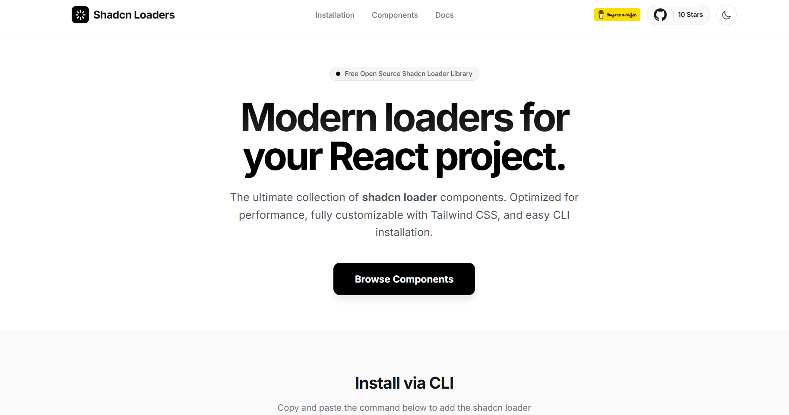

# Shadcn Loaders

A comprehensive collection of modern React loaders and spinners inspired by shadcn/ui. Built with Tailwind CSS and optimized for both dark and light themes.

## Landing Page



The ultimate collection of **shadcn loader** components. Optimized for performance, fully customizable with Tailwind CSS, and easy CLI installation.

### Key Highlights
- **Free Open Source Shadcn Loader Library**
- **Modern loaders for your React project**
- Clean, modern loader UI for React projects
- Easy CLI setup with a single command
- Fully customizable with Tailwind CSS

## NPM Package

- npm: [https://www.npmjs.com/package/shadcn-loaders](https://www.npmjs.com/package/shadcn-loaders)

## Installation

Add a loader component to your project with the shadcn registry syntax:

```bash
npx shadcn add @shadcnloaders/loader
```

This command installs the loader component into your project.

## shadcn Registry

This package also exposes a shadcn-compatible registry entry for direct use with the shadcn CLI:

```json
{
  "name": "@shadcnloaders",
  "homepage": "https://shadcnloaders.com",
  "url": "https://shadcnloaders.com/r/{name}.json",
  "description": "A public registry of shadcn-inspired animated loaders and loading states.",
  "logo": "<svg xmlns='http://www.w3.org/2000/svg' viewBox='0 0 24 24'><rect width='24' height='24' rx='6' fill='#0f172a'/><circle cx='12' cy='12' r='5' fill='#f59e0b'/><circle cx='12' cy='12' r='2.2' fill='#ffffff'/></svg>"
}
```

Registry files are available at:
- [registry.json](registry.json)
- [loader.json](loader.json)
- [registry/loader.tsx](registry/loader.tsx)

## Features

- **Easy CLI setup**: Add loader components with a single npx command.
- **Shadcn-style design**: Clean, modern loader UI for React projects.
- **Tailwind-ready**: Style and customize quickly with utility classes.


## License

This project is licensed under the MIT License.

## Author

Created by [Sammed-Chougule](https://github.com/Sammed-Chougule).
